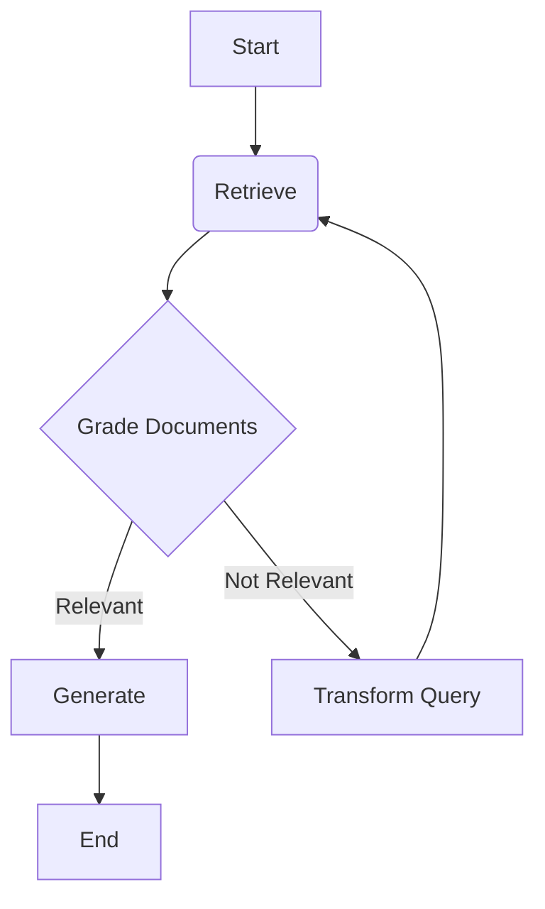

# Agente RAG Cíclico com LangGraph - EM DESENVOLVIMENTO

Este projeto implementa um agente de IA generativa para responder perguntas sobre um documento específico (RAG). A principal característica é o uso do **LangGraph** para criar um fluxo cíclico e auto-corretivo.

## Visão Geral

Ao contrário de um pipeline RAG linear (Recuperar -> Gerar), este agente avalia a qualidade dos documentos recuperados antes de responder.

O fluxo de trabalho é o seguinte:
1.  **Retrieve:** O agente recupera trechos do documento com base na pergunta.
2.  **Grade:** Um LLM avalia se os trechos recuperados são relevantes para responder à pergunta.
3.  **Decide:**
    * **Se Relevante:** O agente segue para o nó `Generate`.
    * **Se Irrelevante:** O agente entra no nó `Transform Query`, reformula a pergunta para melhorar a busca, e retorna ao passo `Retrieve` (formando um ciclo).
4.  **Generate:** O agente usa os documentos relevantes e a pergunta *original* para formular a resposta final.

Este ciclo de "tentativa e correção" torna o agente mais robusto a perguntas ambíguas.

## Estrutura do Grafo



## Como Executar

1.  **Clone o repositório:**
    ```bash
    git clone [https://github.com/SEU_USUARIO/agente_rag_langgraph.git](https://github.com/SEU_USUARIO/agente_rag_langgraph.git)
    cd agente_rag_langgraph
    ```

2.  **Instale as dependências:**
    ```bash
    pip install -r requirements.txt
    ```

3.  **Adicione seu documento:**
    * Coloque o arquivo PDF que você deseja consultar dentro da pasta `/data/`.
    * Renomeie o arquivo para `seu_documento.pdf`.

4.  **Configure sua API Key:**
    * Renomeie o arquivo `.env.example` para `.env` (ou crie um novo).
    * Adicione sua chave de API da OpenAI:
        ```
        GEMINI_API_KEY="sk-..."
        ```

5.  **Execute o agente:**
    ```bash
    python src/main.py
    ```

Após a inicialização (que pode demorar um pouco para processar o PDF), você poderá fazer perguntas no terminal.
